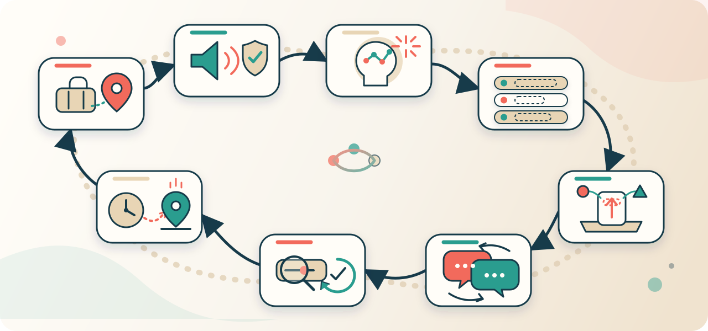
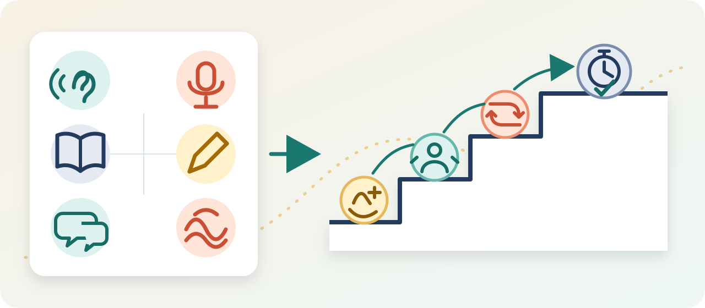

[English](README.md) · [简体中文](README.zh-CN.md) · [日本語](README.ja.md) · [한국어](README.ko.md) · [Español](README.es.md)

# Language Learning Coach

**Start with one real travel task. Build verifiable A2 foundations through the shortest practical route your performance supports.**


Language Learning Coach is an adaptive Codex Skill for learning well-resourced modern languages through real tasks, reliable input, useful phrases, active recall, interaction, focused feedback, and delayed retests.

It is designed first for travel languages such as French, German, Italian, Spanish, Portuguese, Korean, Japanese, Arabic, and English. The language, regional variety, writing system, time available, and what you can actually do all change the lesson.

> [!IMPORTANT]
> “Travel A2” is this project's training route, not an official CEFR sub-level or a certificate. A2 covers simple, direct exchanges in familiar and routine situations; the CEFR places coping with most situations likely to arise while travelling at B1. The coach therefore targets **more confident performance in common, predictable travel tasks**, not stress-free handling of every trip or emergency. See the Council of Europe's [global scale](https://www.coe.int/en/web/common-european-framework-reference-languages/table-1-cefr-3.3-common-reference-levels-global-scale) and [spoken-language descriptors](https://www.coe.int/en/web/common-european-framework-reference-languages/table-3-cefr-3.3-common-reference-levels-qualitative-aspects-of-spoken-language-use).

> [!NOTE]
> This is an independent open-source project inspired by Kazuma's publicly shared learning practices. It is not official, authorized, affiliated with, or endorsed by Kazuma.

## Fast start, not a shortcut

The coach shortens the distance between “I want to learn” and actually handling a ticket, check-in, order, direction, or communication breakdown. The first lesson selects one likely travel task, teaches only the one to three complete phrases needed for it, and asks you to use them immediately.

It does not skip reliable input, changed-condition practice, or delayed retests. “Fast” means removing vocabulary lists, grammar sequences, generic calendars, and material unrelated to your next trip—not promising instant A2, a fixed completion time, or lower standards.

## Learn for the trip, not for the streak


The default travel route tracks seven outcomes. The visual shows the six everyday interaction areas; a seventh, safety-limited basic-help outcome is included in the route:

- **Transport:** ask about tickets, platforms, times, routes, and changes.
- **Accommodation:** check in, confirm details, and describe a simple problem.
- **Food:** order, state preferences, understand a follow-up, and pay.
- **Directions:** ask, identify landmarks, and confirm that you understood.
- **Shopping:** handle price, quantity, size, availability, and payment.
- **Communication repair:** ask someone to repeat, slow down, write, point, or rephrase.
- **Basic help:** handle a pharmacy, lost-property, or other non-emergency request without treating serious emergencies as A2 tasks.

Each active phrase is stored with your version, a replaceable slot, a likely follow-up, and a repair expression. The goal is not a frozen phrasebook: it is completing the task when one detail changes.

Serious medical, legal, immigration, and safety emergencies are not presented as situations that A2 alone makes safe to handle independently.

## Start in one line

```text
Use $language-learning-coach. I am starting Japanese from zero, have 15 minutes
a day, and want to handle basic travel conversations in Japan.
```

If you have not named a language, the first reply contains only:

```text
What language do you want to learn?
```

Then the coach asks only one question at a time—and only when the answer changes the next lesson. You begin a small task instead of receiving a long questionnaire or generic calendar.

Other useful starts:

```text
Use $language-learning-coach. Help me make polite requests in Egyptian Arabic.
Keep the local spoken variety distinct from Modern Standard Arabic.
```

```text
Use $language-learning-coach. Continue yesterday's Brazilian Portuguese.
I only have five minutes today.
```

## The shortest useful route is adaptive



For a spoken travel goal, a typical lesson moves through:

1. choose one real task and the target variety;
2. hear a complete, classified model before seeing the answer;
3. understand the intent and one critical detail;
4. learn one to three complete phrases with replaceable slots;
5. retrieve and transform them as prompts fade;
6. complete a short interaction with a follow-up and repair option;
7. fix one or two task-critical problems, then redo immediately;
8. retry later with a changed place, time, person, item, or condition.

Every continuation starts with one visible next task and a concrete completion condition. One mistake remains an observation; only the same pattern appearing across at least two real lesson dates enters the recurring-error queue. When two active patterns genuinely compete in one situation, the coach can interleave them inside that task instead of drilling each one in a block.

You can also opt into a roughly 30-second micro-immersion action attached to something you already do, such as opening a map or checking a booking. It adds no automatic new material, and reporting that you completed it records practice rather than upgrading ability evidence.

The order changes for reading-only or writing goals, accessibility needs, a new script, tone or pitch contrasts, rich inflection, honorifics, regional varieties, or diglossia. Travel is the primary route; work, exams, reading, writing, media, and heritage goals remain supported when reliable resources exist.

## One micro-lesson, four visible moves


1. **Model:** hear the whole expression from a classified source; text follows when appropriate.
2. **Attempt:** use it inside a ticket counter, hotel desk, restaurant, shop, or direction task.
3. **Focused feedback:** preserve the exchange and correct only what most affects the task.
4. **Retry:** complete it again, then change one condition so recall—not copying—does the work.

AI role-play is useful simulation. It does not prove that you handled a native speaker, natural speed, background noise, a new accent, or an unpredictable real-world response.

## A2 direction, evidence by ability



Listening, spoken production, reading, writing, interaction, and pronunciation are tracked separately. Hearing a phrase does not automatically count as speaking it; reading aloud does not prove interaction; same-session success does not prove retention.

The evidence ladder is:

```text
supported → independent → changed condition → delayed retention
```

The workspace records the task, prompt level, evidence environment, **response medium**, result, date, and next retest. That distinction prevents a typed romanization, an unobserved “I said it,” or a task still waiting for an answer from being stored as audible speech or writing. A travel mission moves from training to same-session, changed-condition, delayed, and real-world checks only when matching evidence exists.

One successful mission is not A2. The internal A2-style screen passes only after at least five of the seven defined travel domains reach delayed or real-world checks with distinct core phrases, communication repair is included, all six tracked abilities have retained evidence linked to exact mission requirements, and at least one mission passes a real-person or real-world check. Only then may the coach say that the evidence is consistent with A2-style performance **in the tested tasks** and name every gap. This is still not a CEFR result; only an appropriate external assessment can establish one. How quickly you progress depends on the language, your starting point, practice time, resource quality, and performance that survives transfer and delay.

## Sound sources are never hidden

For spoken goals, a new phrase is heard before its written answer when playable audio is available. Every model is classified:

| Source class | What it means | What it can support |
|---|---|---|
| `native_official` | Official or institutional recording by a speaker of the target variety | Strong model for the exact material the source covers |
| `native_traceable` | Traceable native-speaker recording with suitable variety, context, and register | Model within the source's documented scope |
| `tts` | Clearly labelled synthetic speech fallback | Initial listening and rehearsal, not native-model or pronunciation evidence |
| `pending` | A reliable model has not yet been delivered | The spoken or pronunciation step pauses instead of being invented |

For TTS, the workspace separately records the expression/register check, target variety, engine or voice, delivered file/player, and technical validation. A playable waveform does not verify that the wording is natural.

Local WAV files are structurally validated before delivery. Technical validity never substitutes for source reliability, correct variety, actual playback, or pronunciation assessment.

## Installation

You need Codex with local Skill support and Python 3 for the bundled audio and workspace validators. The audio validator accepts classic uncompressed RIFF PCM WAV; convert other formats first. The Git method also requires Git.

### Bundled Skill installer

```bash
python3 ~/.codex/skills/.system/skill-installer/scripts/install-skill-from-github.py \
  --repo ai-martin-lau/language-learning-coach \
  --path . \
  --name language-learning-coach
```

### Git

```bash
git clone https://github.com/ai-martin-lau/language-learning-coach.git \
  ~/.codex/skills/language-learning-coach
```

Alternatively, download the repository and copy its contents to:

```text
~/.codex/skills/language-learning-coach
```

Start a new Codex task after installation so the Skill is discovered.

## How the route changes by language

| Language or goal feature | Adaptation |
|---|---|
| Tone, pitch accent, length, or stress contrasts | Perception contrasts before production, followed by sentence-level practice |
| A new or complex writing system | Sound and script progress together; transliteration receives a fade-out plan |
| Rich inflection or agglutination | Whole phrases plus early stem/affix analysis and controlled generation |
| Register, honorifics, dialect continua, or diglossia | Relationship, region, and medium are attached to each expression |
| Reading, writing, work, exam, media, or heritage goals | Skill balance and evidence tasks change to match the real target |

The examples are not a permanent support list. Another modern spoken or written language is in scope when reliable audio, dictionaries, grammar references, and usage evidence are available. Signed, classical, constructed, and resource-scarce languages require specialist materials or coaching beyond this Skill's current scope.

## Local learning state and privacy

When the current workspace is writable, the coach can maintain:

```text
language-learning/<language-slug>/
├── profile.md
├── phrase-bank.md
├── function-map.md
└── progress.md       # travel mission map, retests, and lesson evidence
```

These readable Markdown files store course-relevant goals, constraints, habit anchors, contextualized expressions, audio source classes, per-ability evidence, starter-function coverage, recurring-error observations, optional micro-immersion, and scheduled retests. They remain in the user's workspace, not the installed Skill directory. A bundled validator checks structure and internal consistency without claiming that the recorded learning result is true.

The repository contains no telemetry, account integration, or background service. Codex and user-authorized tools may access external sources when a lesson needs reliable language material; those products' privacy rules still apply.

## Method and evidence

The design draws from Kazuma's public discussions of sound-first imitation, useful phrases, active vocabulary, practical grammar, consistent task-based habits, and interest-driven input. See [the method summary and primary sources](references/kazuma-method.md).

Those practices are not treated as one scientifically validated package. The Skill checks individual choices against second-language acquisition research on pronunciation instruction, formulaic sequences, explicit grammar, interaction and corrective feedback, spacing and retrieval, meaning-focused input, and self-regulation. See [the evidence matrix and guardrails](references/evidence-and-guardrails.md).

The README's use of visual navigation was informed by the language-learning section of [byoungd/up](https://github.com/byoungd/up). The recurring-pattern and interleaving interaction takes product-design inspiration from [m98/fluent](https://github.com/m98/fluent), the optional piggyback practice from [hamsamilton/lang-tutor](https://github.com/hamsamilton/lang-tutor), and the single visible next action from [learn-anything-skill](https://github.com/vesperchinn/learn-anything-skill). These repositories are interaction-design references, not research evidence. All implementation, copy, and artwork here are original.

## Repository structure

```text
.
├── SKILL.md                         # Main behavior and routing instructions
├── agents/openai.yaml              # Codex display metadata
├── assets/
│   ├── learning-workspace/          # Persistent course templates
│   └── readme/                      # Original README visual assets
├── references/
│   ├── kazuma-method.md             # Public method sources and boundaries
│   ├── evidence-and-guardrails.md   # SLA research and scientific limits
│   ├── language-adaptation.md       # Cross-language feature adaptation
│   └── session-protocols.md         # Lessons, feedback, review, and state
├── scripts/validate_audio.py        # Local PCM WAV delivery validator
├── scripts/validate_workspace.py    # Markdown learning-state validator
├── tests/test_validate_audio.py     # Audio validator regression tests
├── tests/test_validate_workspace.py # Workspace validator regression tests
└── docs/plans/                      # Design records
```

## Contributing

Issues and pull requests are welcome, especially for source-backed corrections, better adaptation for mainstream language varieties and travel tasks, clearer safety and evidence boundaries, and natural improvements to the five README translations.

Use English `README.md` as the content source of truth and update all affected translations in the same pull request. Do not add fixed-time A2 claims, unsupported fluency promises, invented native-speaker consensus, fake testimonials, or claims of Kazuma affiliation.

## License

Released under the [MIT License](LICENSE).
